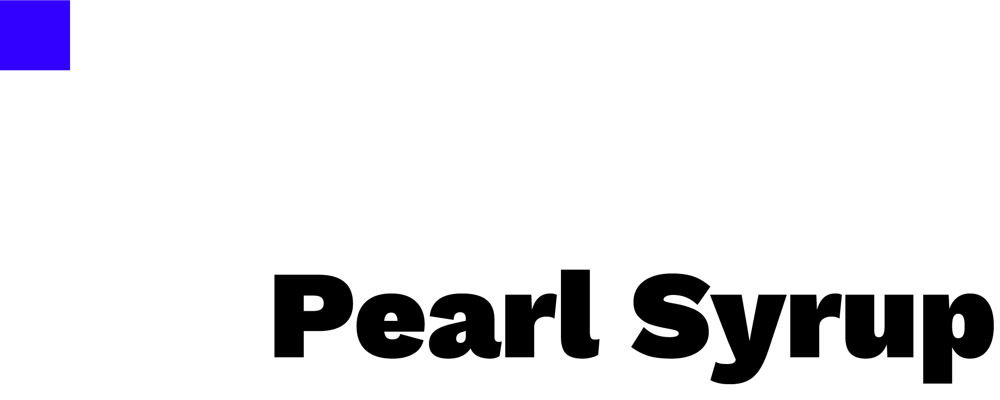
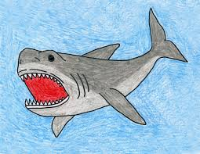
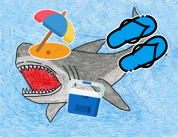
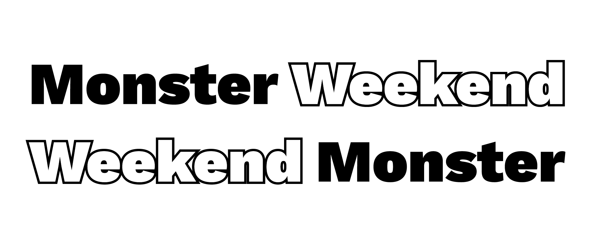
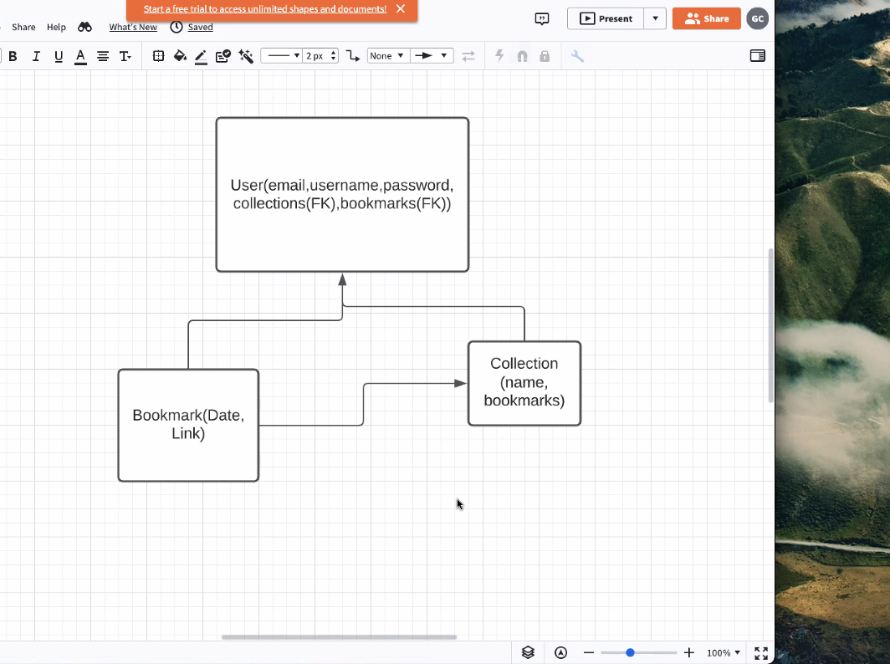
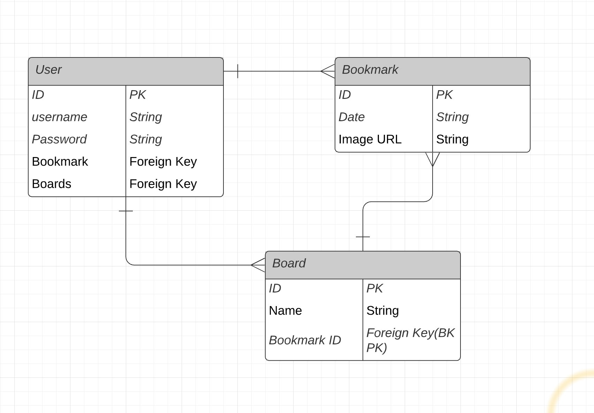
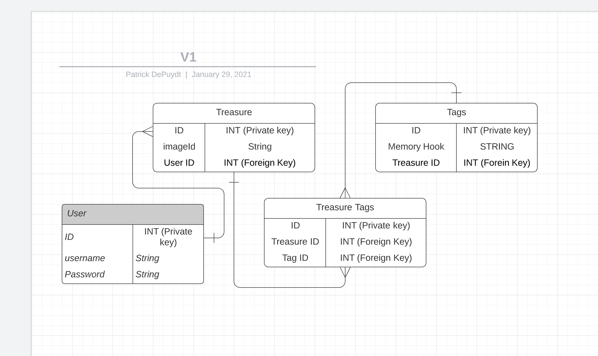
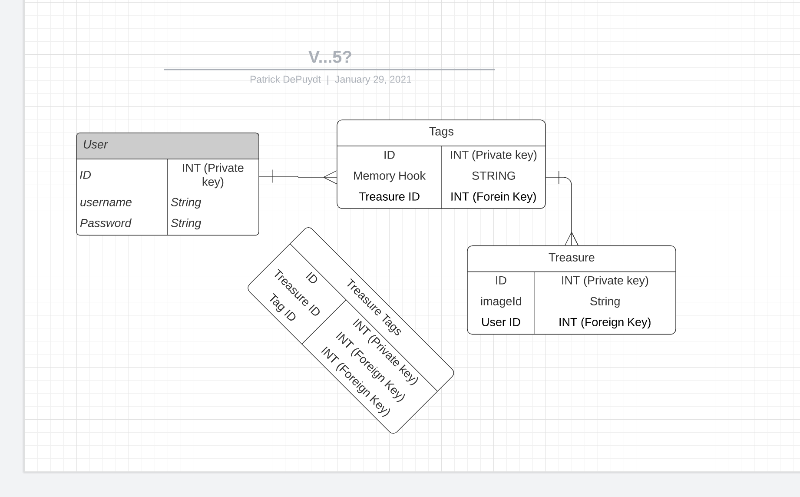

&nbsp;

# Installation
**1. Download repo**
```bash
git clone git@github.com:PatrickDePuydt/RareSupply.git
# 👉 terminal (where you want to download the code to)
```

**2. Install dependencies**
```bash
npm install
# 👉 terminal (in project root directory)
```

**3. Create database**
```
createdb pearl_syrup_development
# 👉 terminal (doesn't matter where you are)
```

**4. Run Migrations**
```
sequelize db:migrate
# 👉 terminal (project root)
```

**5. Fire up server**
```
nodemon
# 👉 terminal (project root)
```

***

## Backstory
| What I thought I was building | What I ended up building |
|:-----------:|:------------:|
|  |  |

&nbsp;
&nbsp;



### What happened

| Stage of grief | Screenshot |
|:-----------:|:------------:|
| <p style="width: 100px;">Beta: Original ERD</p> |   |
| <p style="width: 100px;">Gen2: User has many bookmarks, user has many boards.</p> |   |
| <p style="width: 100px;">V3: User has many treasures, tags have many treasure tags.</p> |   |
| <p style="width: 100px;">V4: Potential... right ERD?</p> |   |
